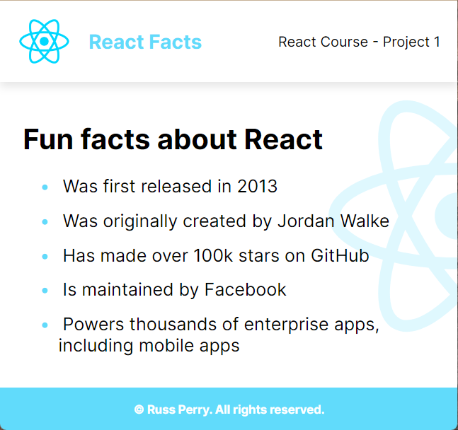

# FCC React Project 1 - Static Page

    

## Some things to consider

- This page was created using `npm create vite@latest`.
- This is just a static page, about React. There's nothing really that fancy about this.
- Got an understanding of how components work, how to set up a react project, and how to style a react project.
- I did not make this responsive. The goal of this project was to get comfortable in react. It was not how to make a responsive website.
- Nav / Links do not work on purpose. Again, this project was not intended to make a functional website.

---

### React + Vite Information.

This template provides a minimal setup to get React working in [Vite](https://vitejs.dev/) with HMR and some ESLint rules.

Currently, two official plugins are available:

- [@vitejs/plugin-react](https://github.com/vitejs/vite-plugin-react/blob/main/packages/plugin-react/README.md) uses [Babel](https://babeljs.io/) for Fast Refresh
- [@vitejs/plugin-react-swc](https://github.com/vitejs/vite-plugin-react-swc) uses [SWC](https://swc.rs/) for Fast Refresh
